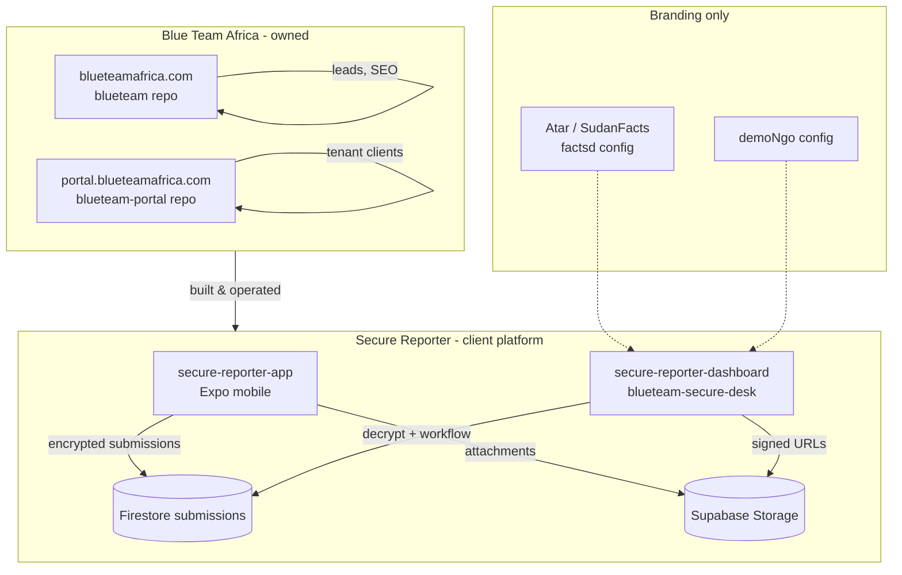

# MASTER_HANDOVER.md

**Prepared:** 2026-05-19  
**For:** Claude Code (permanent takeover from Cursor)  
**Author context:** Compiled from local repos under `~/Documents/`, monorepo `CLAUDE.md` files, and Cursor agent transcripts (Apr–May 2026).

**How to read certainty labels**

| Label | Meaning |
|--------|---------|
| **CERTAIN** | Verified in repo files, git remotes, or explicit user instructions in transcripts |
| **INFERRED** | Reasonable conclusion from naming, folder layout, or partial evidence — verify before acting |
| **UNKNOWN** | Not found in repos/transcripts; do not assume |

---

## Table of contents

1. [Executive map](#executive-map)
2. [secure-reporter-dashboard](#1-secure-reporter-dashboard)
3. [Cross-project relationships](#2-cross-project-relationships)
4. [Mohamed's working style](#3-mohameds-working-style)
5. [Session continuity rules](#4-session-continuity-rules)
6. [Appendix A — Key file index](#appendix-a--key-file-index)

*Extended reference (load only if session targets reporter app, portal, or cross-project work):*

7. [secure-reporter-app](#5-secure-reporter-app)
8. [SudanFacts & Atar (product layer)](#6-sudanfacts--atar-product-layer)
9. [blueteamafrica (marketing site)](#7-blueteamafrica-marketing-site)
10. [blueteam-portal](#8-blueteam-portal)
11. [Ikseer](#9-ikseer)
12. [Fintech / firewall / security consulting](#10-fintech--firewall--security-consulting)
13. [Appendix B — Agent transcript references](#appendix-b--agent-transcript-references)
14. [Appendix C — Unresolved ambiguity](#appendix-c--unresolved-ambiguity-do-not-forget)

---

## Executive map

**CERTAIN:** Mohamed operates **Blue Team Africa** (`BlueTeamAfrica` on GitHub) — web design, hosting, cybersecurity, and managed services in East Africa (Rwanda/Uganda positioning on marketing site).

**Two product lines:**

| Line | Repos | Primary users |
|------|--------|----------------|
| **Blue Team business ops** | `blueteamafrica`, `blueteam-portal` | Staff + paying clients |
| **Secure Reporter / Secure Desk** | `secure-reporter-app`, `secure-reporter-dashboard` | Field sources/reporters + newsroom/editorial staff |

**SudanFacts and Atar are not separate codebases.** They are **branded workspace configurations** on the Secure Reporter dashboard (`factsd` config). Legacy Sudan Facts web assets exist as WordPress/images, not as active app repos.

**Ikseer** is **not a software project** in `~/Documents/Ikseer` — only scanned PDF/DOCX magazine archives.

**Fintech firewall consulting** has **no dedicated repo** in Documents; treat as client/consulting work (**INFERRED** from user’s project list + `Projects/MESL SOLUTIONS` folder name).

---

# 1. secure-reporter-dashboard

## 1. Project Summary

| Field | Detail |
|--------|--------|
| **Purpose** | **Blue Team Secure Desk** — multi-tenant admin dashboard for encrypted submissions: decrypt, editorial workflow, assignment, notes, export (DOCX), attachments (signed URLs). |
| **Owner/client** | **CERTAIN:** Product by Blue Team Africa; default tenant config serves **Atar / Sudan Facts** newsroom. `demoNgo` config for demos. |
| **Business context** | Newsroom/editorial desk replacing ad-hoc channels; maps case statuses to publishing pipeline language (Raw Materials → Published). |
| **Why it exists** | Server-side counterpart to mobile reporter; only place decrypted content should appear. |
| **Relationships** | Reads `submissions` collection written by app; **must not** modify reporter app when dashboard-only tasks specified. |

## 2. Current State

### Completed (**CERTAIN**)

- Next.js 16 App Router dashboard with `(dashboard)` shell, sidebar, case queue.
- Multi-tenant **workspace config** pattern: `factsd` (default), `demoNgo` via `NEXT_PUBLIC_WORKSPACE_CONFIG_ID`.
- RBAC: `owner`, `admin`, `reviewer`, `intake`, `readonly` (`app/_lib/rbac.ts`).
- Auth: Firebase email/password; `adminUsers/{uid}.active`; role from `/api/me` + `users/{uid}`.
- Server-only decrypt: `app/api/admin/submissions/[id]/decrypt/route.ts`.
- Case model centralized: `app/_lib/caseWorkspaceModel.ts`.
- Export: DOCX, manual download; OneDrive adapter stubbed/disabled in `factsd` config.
- Branded routes: `/dashboard`, `/sudanfacts` (re-exports same shell — no duplicated logic).
- Editorial manifest generation on `dev`/`build`.
- Firebase Admin via `FIREBASE_SERVICE_ACCOUNT_BASE64` (Vercel-friendly).
- Extensive UI sprints: KPI cards, sidebar stage views, activity feed humanization, auto-decrypt for permitted roles, Sprint 2 branding fixes.
- Production hardening commits on `main` (May 2026): decrypt diagnostics, 401 handling, base64 service account.

### Partially completed

- **Firestore rules not in repo** (**CERTAIN** from Phase 7 audit transcript) — deployed rules unknown from codebase alone.
- `settings/branding` Firestore doc vs static config — branding provider was debugged; confirm production source of truth.
- OneDrive export: configured but `enabled: false` in `factsd`.
- `googleDrive` export: stub.
- Team roster page: copy says invitations “later phase”.

### Pending / interrupted

- Commit/push discipline: user must **explicitly ask** to commit; several sessions ended with **uncommitted** decrypt/401 fixes.
- Remove temporary 401 debug JSON from `requireActiveAdmin` when production stable.
- Firestore rules documentation + repo copy (recommended from security audit).
- Workspace isolation for true multi-tenant SaaS (configs exist; **INFERRED** single Firebase project today).

### Blockers (historical — verify current)

| Blocker | Detail |
|---------|--------|
| Vercel 401 on decrypt | Traced to `requireActiveAdmin` / token / Admin SDK project mismatch / `adminUsers` doc |
| KPI “Needs a lead” not navigating | Fixed by using configured `href` not bare `/dashboard` |
| Over-aggressive signout on 401 | Fixed: refresh token + retry, inline error vs global signout |
| Card titles showing placeholders | Prod payload shape vs extractor |

### Technical debt

- No test runner; lint + build only.
- Legacy field names (`processingStatus` vs `caseStatus`) normalized in model layer — keep normalization centralized.
- Client-side `adminUsers` read in `AuthContext` — security audit flagged rules dependency.
- `server-only` package version `0.0.1` in package.json (odd but works).

## 3. Architecture

| Layer | Technology |
|--------|------------|
| **Stack** | Next.js 16.2.4, React 19, Firebase client + Admin, Supabase service role (server), `docx`, ESLint 9 |
| **Hosting** | **CERTAIN:** Vercel, GitHub `BlueTeamAfrica/blueteam-secure-desk` |
| **Config selector** | `app/_lib/org/getWorkspaceConfig.ts` |

**Firestore collections (dashboard)**

- `submissions` — encrypted payloads + case metadata
- `adminUsers/{uid}` — `{ active: true }` gate
- `users/{uid}` — `{ role: WorkspaceRole }`
- **INFERRED:** `settings/branding`, audit/submission logs (referenced in transcripts)

**API auth patterns**

- `/api/admin/*` → `requireActiveAdmin` (Bearer Firebase ID token + active admin)
- `/api/workspace/*` → token check without admin gate (per CLAUDE.md)

**Env** (`.env.example`)

- `NEXT_PUBLIC_FIREBASE_*`
- `FIREBASE_SERVICE_ACCOUNT_BASE64` (preferred) or legacy PEM trio
- `SUBMISSION_PAYLOAD_SECRET` (must match app `EXPO_PUBLIC_SUBMISSION_PAYLOAD_SECRET`)
- `SUPABASE_URL`, `SUPABASE_SERVICE_ROLE_KEY`, `SUPABASE_BUCKET`
- `NEXT_PUBLIC_WORKSPACE_CONFIG_ID` — `demoNgo` or omit for `factsd`

## 4. Product Decisions

| Decision | Why |
|----------|-----|
| **Approved workflow blueprint** (Apr 2026) | User forbade improvising statuses/tabs; fixed case lifecycle |
| **Do not change reporter app from dashboard tasks** | Repeated explicit constraint |
| **Editorial language for Atar** | Statuses named Raw Materials → Published, not generic CRM |
| **Manual decrypt removed for eligible roles** | Auto-decrypt in UI for roles that already had permission |
| **Protected message / internal notes vocabulary** | Product language standardization |
| **Intake role restrictions** | Proofreader desk sees subset of stages |
| **Security > convenience** | No client-side decryption keys; server-only decrypt route |

## 5. Technical Decisions

- Workspace config drives all copy, workflow stages, nav hrefs, export provider.
- Decryption: `app/_lib/server/decryptEncryptedPayload.ts` mirrors mobile algorithm exactly.
- Attachment download: Supabase signed URLs via service role (never expose to browser).
- Editorial images: `public/editorial/` + generated manifest.
- Auth redirects preserve `?next=` (e.g. return to `/sudanfacts` after login).

## 6. Known Problems / Weirdness

- **Do not touch** `caseWorkspaceModel.ts` normalization without auditing all list/detail filters.
- **401 vs 403:** 401 = auth/admin gate; 403 = RBAC — debug separately.
- **Same-route KPI clicks** feel broken if `href` doesn’t change query param.
- **Firestore rules absent from repo** — production security unverified from git alone.
- **Next.js 16** breaking changes — project `AGENTS.md` warns APIs differ from training data; read `node_modules/next/dist/docs/`.

## 7. Roadmap State

**Last on `main` (git):** `583e23e chore: production cleanup after Firebase Admin fix`

**Recent transcript themes:** Production decrypt 401, Firebase Admin base64, `/sudanfacts` route, product inspection canvas, Phase 7 security audit top-10 fixes.

**Next logical steps**

1. Confirm Vercel env: `FIREBASE_SERVICE_ACCOUNT_BASE64`, `SUBMISSION_PAYLOAD_SECRET`, Supabase keys, correct Firebase project.
2. Add `firestore.rules` to repo + document deployment.
3. Remove temp 401 debug responses when stable.
4. Decide branding source: static config vs `settings/branding` Firestore.
5. Enable/disable OneDrive export per client request.

---

# 2. Cross-project relationships



### What is Secure Reporter?

**CERTAIN:** A **two-repo system**: mobile capture app + web dashboard. End-to-end encrypted tips/stories with newsroom workflow on the desk side.

### Relation to SudanFacts and Atar

- **Atar / Sudan Facts** = **default workspace branding** on the dashboard (`factsd`), not separate deployments.
- **SudanFacts.org** WordPress folder is **legacy/separate** from Secure Desk.

### Who owns what?

| Asset | Owner |
|--------|--------|
| Blue Team marketing + portal | Blue Team Africa (Mohamed) |
| Secure Reporter platform code | BlueTeamAfrica / BlueTeamForAfrica GitHub orgs |
| Atar/Sudan Facts editorial use | Client newsroom (**INFERRED**) on Blue Team–hosted stack |

### Consulting vs owned

| Type | Examples |
|------|-----------|
| **Owned products** | `blueteamafrica`, `blueteam-portal`, Secure Reporter stack |
| **Client / editorial** | Atar, Sudan Facts (on Secure Desk) |
| **Consulting** | Fintech firewall work (**no repo**) |
| **Archive only** | Ikseer PDFs |

### Shared infrastructure?

| Shared? | Detail |
|---------|--------|
| **Auth** | **No** across portal vs Secure Desk vs marketing (separate Firebase projects) |
| **Firestore** | **No** between portal and Secure Reporter |
| **Secrets** | **Yes** — `SUBMISSION_PAYLOAD_SECRET` must match app + dashboard |
| **Supabase** | **Yes** — app upload + dashboard download |
| **SaaS plans** | Portal has `planPermissions`; Secure Desk has workspace configs — **different models** |

### GitHub map (**CERTAIN**)

| Repo | Remote |
|------|--------|
| `blueteamafrica` | `BlueTeamAfrica/blueteam` |
| `blueteam-portal` | `BlueTeamAfrica/blueteam-portal` |
| `secure-reporter-dashboard` | `BlueTeamAfrica/blueteam-secure-desk` |
| `secure-reporter-app` | `BlueTeamForAfrica/secure-reporter-app` |

---

# 3. Mohamed's working style

Derived from **repeated transcript patterns** (Apr–May 2026). Treat as operational requirements for Claude.

### Roadmap & planning

- **Architecture-first:** Defines **approved blueprints** (e.g. Secure Desk workflow spec) and expects strict adherence — “do not improvise”, “do not add random tabs”.
- **Phased sprints:** Names phases (Sprint 2 branding, Phase 7 security audit, production stabilization).
- **Scope boundaries:** Often says **do not touch** other repos (e.g. dashboard-only tasks must not change reporter app).

### Security-first mindset

- Reporter safety > UX convenience.
- No sensitive content in logs; neutral mobile UI language.
- Server-only decrypt; questions Firestore rules even when Admin SDK bypasses them in API routes.
- Post-submit purge, decoy PIN, panic mode — non-negotiable directionally.

### Verification habits

- **Verify live systems** before closing issues (Vercel build logs, production 401, Firestore doc existence).
- **Dislikes assumptions:** Requests runtime instrumentation (auth uid, tenantId, roles, `planPermissions`, token presence) when permissions fail.
- Wants **factual confidence** — distinguish 401 vs 403, UI vs rules vs API gate.

### Iterative workflow

- Fix → lint/build → device test → next issue.
- When fix fails, asks to **find active cause**, not resummarize previous attempts (see typing interruption follow-up).
- Prefers **continuity** across sessions; handover docs should preserve open ambiguity.

### Troubleshooting style

- Paste production logs (Vercel) verbatim.
- Trace full permission chains (UI → API → Firestore rules).
- Temporary **safe debug** acceptable (token length, not token value).

### Expectations from AI assistant

- Run commands locally; don’t give up after one failure.
- **Do not commit** unless explicitly asked.
- **Do not push** portal fixes only to monorepo — use canonical `blueteam-portal` clone.
- Minimize diff scope; match existing conventions.
- Produce structured reports (numbered sections, file paths, priority lists) for audits.
- Complete sentences; no engagement baiting.

---

# 4. Session continuity rules

When resuming after interruption, Claude should:

### 1. Re-establish ground truth

- Read this file + project `CLAUDE.md` first.
- `git status`, `git log -3`, and identify **uncommitted** work before new features.
- Confirm **which repo** is canonical for the task (portal vs monorepo copy).

### 2. Label certainty

- State **CERTAIN / INFERRED / UNKNOWN** for Firebase project IDs, URLs, and client priorities.
- If env vars are missing, ask or read `.env.example` — do not invent values.

### 3. Preserve open threads

Check transcript-equivalent status for known open items:

| Project | Open thread |
|---------|-------------|
| secure-reporter-app | Production QA matrix; APK audit; remove debug logs |
| secure-reporter-dashboard | 401 debug removal; firestore.rules in repo; branding source of truth |
| blueteam-portal | Invoice create permission trace (`canInvoices`, owner role) |
| blueteamafrica | Production form + image 404 verification |

### 4. Do not over-summarize

- Keep file paths, collection paths, and env var names in working notes.
- When user says a fix failed, **reproduce** their steps before proposing new architecture.

### 5. Operational checklist per task type

| Task type | First steps |
|-----------|-------------|
| Permission bug | Log uid, tenantId, roles from both `users` and `userTenants`, rules field, UI boolean |
| Decrypt failure | Check `SUBMISSION_PAYLOAD_SECRET`, Admin SDK projectId, Bearer header, `adminUsers.active` |
| Reporter send failure | App repo only; trace `syncQueuedItem`, Supabase upload, attachment skip logs |
| Portal invoice | `planPermissions/{planId}.canInvoices`, rules line 128, UI gate files |
| Deploy | `npm run build`, Vercel env, never commit `.env.local` |

### 6. Sync workflow (portal)

After editing `blueteamafrica/blueteam-portal/`:

```bash
rsync -av --delete \
  --exclude='.git' --exclude='node_modules' --exclude='.next' --exclude='.env.local' \
  ~/Documents/blueteamafrica/blueteam-portal/ ~/Documents/blueteam-portal/
cd ~/Documents/blueteam-portal && npm run build
# commit + push only when Mohamed asks
```

### 7. Secrets & safety

- Never commit `.env.local`, service account JSON, or API keys from README samples.
- Rotate keys if exposed in chat or public README.

---

## Appendix A — Key file index

### secure-reporter-app

| Path | Role |
|------|------|
| `app/_layout.tsx` | Global security, routing guards |
| `app/unlock.tsx`, `app/home.tsx`, `app/report/new.tsx` | Core UX flows |
| `src/state/session.ts`, `device.ts`, `drafts.ts` | Security + queue |
| `src/lib/submissions.ts` | Encrypted Firestore write |
| `CLAUDE.md` | Commands, env, architecture |

### secure-reporter-dashboard

| Path | Role |
|------|------|
| `app/_lib/org/configs/factsd.ts` | Atar/Sudan Facts workspace |
| `app/_lib/caseWorkspaceModel.ts` | Case normalization |
| `app/_lib/rbac.ts` | Permissions |
| `app/_lib/server/decryptEncryptedPayload.ts` | Decryption |
| `app/_components/auth/AuthContext.tsx` | Auth lifecycle |
| `app/api/admin/submissions/[id]/decrypt/route.ts` | Decrypt API |

### blueteam-portal

| Path | Role |
|------|------|
| `lib/tenantContext.tsx`, `lib/server/resolvePortalUser.ts` | Tenancy |
| `lib/tenantBillingPlan.ts` | Plan ID resolution |
| `firestore.rules` | Security |
| `app/api/cron/*` | Billing/notifications |

### blueteamafrica

| Path | Role |
|------|------|
| `CLAUDE.md` | Monorepo layout + sync |
| `app/api/leads/route.ts` | Contact form |
| `blueteam-portal/` | Portal copy (sync to standalone) |

---

<!-- EXTENDED REFERENCE — stop here for dashboard sessions -->
## Extended project reference

Read this section only if your session targets one of:
- `secure-reporter-app` (reporter mobile app, shared encryption contract, or SUBMISSION_PAYLOAD_SECRET)
- `blueteam-portal` (client portal, invoice permissions, tenant billing)
- `blueteamafrica` (marketing site, contact form, monorepo sync)
- Cross-project planning or unresolved ambiguity review

Otherwise stop here.

---

# 5. secure-reporter-app

## 1. Project Summary

| Field | Detail |
|--------|--------|
| **Purpose** | High-risk **field reporter mobile app** (Expo/React Native): capture encrypted notes, optional attachments, queue offline, sync to Firebase/Supabase; **no persistent local copy after confirmed server receipt**. |
| **Owner/client** | **CERTAIN:** Built by Blue Team Africa (`productOwner: "Blue Team Africa"` in dashboard config). **INFERRED:** Primary editorial client branding is **Atar / Sudan Facts** newsroom. |
| **Business context** | Protects reporters under duress: plausible deniability, stealth UI language, panic/decoy modes. |
| **Why it exists** | Mobile intake for sensitive tips/stories where convenience is sacrificed for safety. |
| **Relationships** | Pairs with `secure-reporter-dashboard` (decrypt, workflow, export). Shares `SUBMISSION_PAYLOAD_SECRET` + Supabase bucket with dashboard. **Does not** share Firebase/Auth with `blueteam-portal`. |

## 2. Current State

### Completed (**CERTAIN** from code + transcripts)

- Expo Router app with global security in `app/_layout.tsx` (lock on background, decoy routing, privacy overlay, panic trigger).
- Dual PIN: real + decoy (`src/state/device.ts`); decoy → `/cover` harmless shell.
- Draft encryption: AES-256-CBC in AsyncStorage, key = SHA-256(PIN) (`src/lib/crypto/drafts.ts`).
- Submission encryption: AES with `EXPO_PUBLIC_SUBMISSION_PAYLOAD_SECRET` before Firestore write.
- Attachment pipeline: document picker → sandbox copy → Supabase Storage upload on sync.
- Report lifecycle: `draft → ready → queued → syncing → confirmed → purged` with tombstones to prevent re-materialization.
- Post-submit **auto-purge** after confirmed server success only.
- Stealth UX: neutral user-facing copy (avoid “report”, “encrypted”, etc. on visible screens).
- Panic mode: triple-tap / long-press header; locks session, neutral screen.
- Hidden decoy PIN setup: long-press version in Settings → “Change backup code”.
- Production stabilization passes (May 2026): unlock → Home (not auto-editor); Save/Ready/Pending → return Home; text-only submissions; optional attachments; “Add to pending” on Home for ready items; missing local attachment files skipped (non-fatal).
- Typing interruption fix: inactivity timer reset on `onChangeText` (root cause was 15s lock firing during continuous typing).

### Partially completed / fragile

- **INFERRED:** Camera/audio capture listed as future goals in dependency audit; not fully implemented.
- Firebase Functions `attachmentRelay` / `attachmentRollback` exist but **CERTAIN:** legacy, not called by current app (direct Supabase upload).
- Git history is thin (`0f94051 Clean Expo template`, `9fd4ac1 Initial commit`) — much feature work may be local/unpushed or squashed.

### Pending work (**from transcripts**)

- Full **production-readiness** checklist before store/APK distribution.
- **APK size audit** (Expo packages classified keep/remove/review — do not uninstall without confirming plugin usage).
- Screen privacy / screenshot blocking hardening (Android recents).
- Field reliability layer fully validated on bad networks (retry, stable `clientSubmissionId`).
- Remove temporary `[EDITOR DEBUG]` logs before production if still present.

### Blockers

- **UNKNOWN:** App Store / Play deployment credentials, EAS profiles, production Firebase project IDs (not in repo).
- Physical device testing required for lock/panic/decoy flows.

### Technical debt

- No automated tests (**CERTAIN** in `CLAUDE.md`).
- CryptoJS + MD5 IV derivation (legacy compatibility with dashboard — **do not change** without coordinated migration).
- Plaintext reporter metadata on Firestore submissions (`reporterProfile.ts`) — intentional tradeoff **INFERRED** for desk routing.

## 3. Architecture

| Layer | Technology |
|--------|------------|
| **Stack** | Expo ~54, React Native 0.81, Expo Router 6, TypeScript |
| **Local state** | Plain TS modules in `src/state/` (not React Context) |
| **Remote** | Firestore REST (`experimentalForceLongPolling`), Supabase Storage |
| **Secrets** | `expo-secure-store` for PIN hashes; in-memory session PIN only |

**Data flow**

```
Reporter types → encrypted AsyncStorage drafts
  → ready/queued → syncQueuedItem
    → upload attachments (Supabase)
    → AES encrypt payload → Firestore submissions doc
    → confirmed → purge local + tombstone
Dashboard decrypts server-side only
```

**Env vars** (`.env.local`, all `EXPO_PUBLIC_*` unless noted):

- Firebase web config (6 vars)
- `EXPO_PUBLIC_SUPABASE_URL`, `EXPO_PUBLIC_SUPABASE_ANON_KEY`, `EXPO_PUBLIC_SUPABASE_BUCKET`
- `EXPO_PUBLIC_SUBMISSION_PAYLOAD_SECRET`
- Cloud Function secret: `REPORTER_ATTACHMENT_UPLOAD_SECRET` (**CERTAIN** in CLAUDE.md)

**Deployment**

- **CERTAIN:** Repo `https://github.com/BlueTeamForAfrica/secure-reporter-app.git`
- Mobile builds via Expo (`npm run ios` / `android`); **UNKNOWN** production pipeline.

## 4. Product Decisions

| Decision | Why |
|----------|-----|
| **Reporter anonymity > convenience** | Dual PIN, decoy shell, neutral UI, no submitted history on device |
| **Submitted reports disappear locally after confirmation** | Device is not record of truth; reduces seizure risk |
| **Attachments optional** | Text-only tips must work; missing files must not fail send |
| **Never reveal dual-mode** | Wrong PIN behavior must not hint decoy exists |
| **Lock on background** | Except document-picker transient guard |
| **2-minute inactivity timeout** | Extended by explicit user interaction including typing |
| **No content in logs** | Transcripts repeatedly require no filenames/paths/content in production logs |

## 5. Technical Decisions

- **PIN hashing:** SHA-256 via `expo-crypto`, stored in Secure Store.
- **Draft/submission crypto:** AES-256-CBC; key `SHA256(secret)`, IV `MD5("iv:"+secret)` — must match dashboard.
- **Attachments:** Supabase direct upload (not Firebase Storage for current path).
- **Session PIN:** Memory-only after unlock; cleared on lock.
- **Purge tombstones:** `purge_tombstones` AsyncStorage key prevents ghost re-listing.

## 6. Known Problems / Weirdness

| Issue | Notes |
|--------|--------|
| Typing interruption | **Fixed** May 2026 — verify on device after any session/timer changes |
| Auto-open editor after unlock | **Fixed** — must land on Home |
| Attachment required bug | **Fixed** — text-only path |
| Missing local file on send | **Fixed** — skip with warning, do not fail report |
| `documentPickerTransientActive` | Required — otherwise false lock during picker |
| Do not change encryption scheme unilaterally | Breaks dashboard decrypt |

## 7. Roadmap State

**Last active work (May 2026 transcripts):** Production stabilization, flow correction (Home-centric), direct “Queue” from Home, dependency/APK audit request.

**Next logical steps**

1. Device QA matrix (unlock, decoy, panic, offline queue, purge, attachment skip).
2. Strip debug logs; confirm env parity with dashboard Firebase/Supabase/secrets.
3. EAS/production build config if shipping APK.
4. Camera/audio only when explicitly scoped.

---

# 6. SudanFacts & Atar (product layer)

> Not a separate repository. Documented here because Mohamed lists them as projects.

## 1. Project Summary

| Field | Detail |
|--------|--------|
| **Purpose** | **Atar** = editorial desk / newsroom brand; **Sudan Facts** = related media brand. Together they are the **default Secure Desk workspace** (`factsd`). |
| **Owner/client** | **INFERRED:** Sudan Facts / Atar newsroom is the **client**; platform operator is **Blue Team Africa**. |
| **Business context** | Investigative/editorial workflow in hostile environment; uses Secure Reporter stack. |
| **Why it exists** | Client-specific terminology and pipeline stages on shared product. |
| **Relationships** | `secure-reporter-dashboard` config `app/_lib/org/configs/factsd.ts`; route `/sudanfacts`; legacy web assets under `~/Documents/Wordpress/Sudanfacts.org` and Desktop image folders. |

## 2. Current State

- **CERTAIN:** Dashboard branding: “Atar Editorial Desk”, workspace name “Atar / Sudan Facts”, logo `/editorial/sf1.png`.
- **CERTAIN:** Workflow stages mapped to newsroom phases (see config `caseStatusLabels`).
- **CERTAIN:** Export provider `manualDownload`; OneDrive folders mapped but disabled.
- WordPress site folder exists — **UNKNOWN** if still hosted/production.
- Marketing/design assets on Desktop (`Sudanfacts illus`, `webp-sudanfacts`) — not wired to app automatically.

## 3–5. Architecture / Decisions

- Uses full Secure Reporter architecture; no separate backend.
- Product decision: **small newsroom** RBAC — viewers can see lists (`permissions.ts` comment in codebase).
- Arabic support mentioned in dashboard inspection — verify per-page if client requires RTL.

## 6. Known Problems

- Confusion between **SudanFacts website** (WordPress/marketing) vs **Secure Desk** (Firebase app) — keep deployments separate.
- Branding debug session (Apr 2026): Firestore `settings/branding` vs static config mismatch caused fallback “Workspace” labels.

## 7. Roadmap

- **INFERRED:** Continue editorial workflow polish on shared dashboard, not a fork.
- Legacy WordPress migration/maintenance **UNKNOWN** priority.

---

# 7. blueteamafrica (marketing site)

## 1. Project Summary

| Field | Detail |
|--------|--------|
| **Purpose** | Public marketing website for **Blue Team Africa** — services, portfolio, blog, SEO, lead capture. |
| **Owner/client** | **CERTAIN:** Owned by Blue Team Africa (Mohamed’s company). |
| **Business context** | Lead generation for web design, hosting, ERP, CRM, mobile, cybersecurity in Rwanda/East Africa. |
| **Why it exists** | Commercial presence separate from internal portal. |
| **Relationships** | Monorepo includes copy of `blueteam-portal/` but **must not mix** portal code into marketing routes. Canonical portal is separate repo. |

## 2. Current State

### Completed (**CERTAIN**)

- Next.js 16, App Router, Tailwind, Framer Motion.
- Service pages, portfolio, blog, FAQ, company/about, contact.
- Contact API `app/api/leads/route.ts` with rate limiting, sanitization, Firebase Admin → Firestore in production.
- SEO: JSON-LD, sitemap via `next-sitemap` postbuild.
- Extensive image normalization/rename work (many `*_COMPLETE.md` reports in repo).
- Vercel deployment docs; canonical URLs `https://www.blueteamafrica.com/`.
- Brand colors: primary `#1982c4`, secondary `#D97706`, dark `#0F172A`.

### Partially completed

- Image/asset pipeline — many status markdown files suggest iterative fixes; verify 404s before launch claims.
- `NEXT_STEPS.md` still lists placeholder image tasks — may be outdated vs current `public/images/`.

### Pending

- GA4 optional.
- Custom domain env on Vercel (`DEPLOY_VERCEL.md`, `FIREBASE_SETUP.md`).
- Disk space / build issues were documented (`DISK_SPACE_FIXED.md`) — re-verify if builds fail.

### Blockers

- **UNKNOWN:** Current production URL vs `blueteam-git-main-*.vercel.app` preview URLs in docs.

### Technical debt

- Two apps in one repo (marketing + portal copy) — easy to run commands from wrong directory.
- `upstream` remote points to `blueTeamAfrica` typo repo — verify intentional.

## 3. Architecture

| Item | Detail |
|------|--------|
| **Stack** | Next.js 16.0.7, React 18, Tailwind 3, Firebase client + admin for leads |
| **Port** | 3000 (conflicts if portal also on 3000 — run one at a time) |
| **Deploy** | Vercel; GitHub `BlueTeamAfrica/blueteam` |
| **Leads** | Production: Firestore; dev: `data/leads.json` fallback documented in older status files |

**Monorepo sync rule (`CLAUDE.md`)**

```bash
rsync -av --delete \
  --exclude='.git' --exclude='node_modules' --exclude='.next' --exclude='.env.local' \
  ./blueteam-portal/ ~/Documents/blueteam-portal/
```

## 4. Product Decisions

- **CERTAIN:** Portal must **not** touch `blueteamafrica.com` marketing code (original portal creation brief).
- Removed non-existent service pages (consulting, system-integration, digital-transformation) per `READY_TO_PUSH.md`.
- Contact form: strong validation, rate limits (5/hour/IP in route).

## 5. Technical Decisions

- Separate Firebase project for marketing leads vs `blueteam-portal` Firebase (**INFERRED** from separate setup docs).
- WebP images under `public/images/` with blueprint enforcement scripts.

## 6. Known Problems

- Form 404 on Vercel documented in `FIX_FORM_ERROR_VERCEL.md`, `FIX_API_404.md` — check env + route deployment.
- Running `npm run dev` at repo root vs `blueteam-portal/` causes confusion.
- Large number of historical troubleshooting markdown files — trust **`CLAUDE.md`** and git over old urgency docs.

## 7. Roadmap State

**Last git commits:** Portal client UX features mirrored from standalone portal (`7654bd4 feat(blueteam-portal): client portal UX...`).

**Next:** Verify production contact form → Firestore; finish any remaining image 404s; keep portal sync via rsync + push to `blueteam-portal` repo.

---

# 8. blueteam-portal

## 1. Project Summary

| Field | Detail |
|--------|--------|
| **Purpose** | **SaaS client portal** for Blue Team Africa: staff `/portal/*` and client `/client/*` — clients, services, invoices, subscriptions, projects, support tickets, notifications. |
| **Owner/client** | **CERTAIN:** Blue Team Africa internal product for **their** managed-service customers. |
| **Business context** | Operational hub replacing spreadsheets/email for billing and service health. |
| **Why it exists** | Separate from public site; multi-tenant B2B2C. |
| **Relationships** | Firebase project `blueteam-portal`; optional copy in `blueteamafrica/blueteam-portal/`. |

## 2. Current State

### Completed (**CERTAIN**)

- Next.js 14 App Router, Firebase Auth + Firestore.
- Multi-tenancy: `tenants/{tenantId}/…`, `userTenants/{uid}_{tenantId}`, client users via `users/{uid}` with `clientId`.
- Roles: staff `admin`/`owner` → `/portal`; `client` → `/client/dashboard`.
- Billing plan gating: `lib/tenantBillingPlan.ts` + matching `firestore.rules` `getBillingPlanId`.
- Cron routes: `generate-invoices`, `client-notifications`.
- PDF invoices (`@react-pdf/renderer`), nodemailer email, notification dedupe keys.
- Client mobile-first card lists, Action Required dashboard card, support tickets.
- `firestore.rules` + indexes in repo.
- Canonical repo: `~/Documents/blueteam-portal` → **push here**, not only monorepo copy.

### Partially completed

- Invoice creation permission denied issues — **instrumentation requested** in transcript (owner role + `planPermissions.canInvoices`); may be unresolved.
- ESLint ignored during build (`CLAUDE.md`).

### Pending

- Any uncommitted portal work in monorepo needs rsync to standalone + push.
- Deploy rules/indexes after permission changes: `firebase deploy --only firestore:rules,firestore:indexes`.

### Technical debt

- Legacy `userTenants` query paths + deterministic doc IDs (both supported).
- Index missing → in-memory sort fallback (hides missing index problems).
- README still shows early admin-only schema — superseded by tenant model.

## 3. Architecture

| Item | Detail |
|------|--------|
| **Stack** | Next.js 14, React 18, Tailwind 3, Firebase, nodemailer, react-pdf |
| **URL** | `NEXT_PUBLIC_PORTAL_URL=https://portal.blueteamafrica.com` (from CLAUDE.md) |
| **Deploy** | **INFERRED** Vercel or similar — **UNKNOWN** exact host from repo |
| **Tenant resolution** | `TenantProvider` → `resolvePortalUser.ts` (server), same order as rules |

**Subcollections under `tenants/{tenantId}/`**

`clients`, `projects`, `services`, `subscriptions`, `invoices`, `tickets` (+ replies), `notifications`, `payments`, `planPermissions/{planId}`

**Email URL helper**

- Staff links: `portalBaseUrl()`
- Client emails: `clientFacingEmailBaseUrl()` strips `/portal` so links hit `/client/...`

## 4. Product Decisions

| Decision | Why |
|----------|-----|
| **Separate Firebase project** from marketing site | Security isolation |
| **Clients never see other clients’ data** | `clientId` filtering + rules |
| **Plan permissions default** | `canInvoices != false` in rules — missing doc should allow unless explicitly false |
| **Client-friendly health labels** | Separate maps in `serviceHealth.ts` |
| **Notifications idempotent** | `dedupeKey` as doc ID |

## 5. Technical Decisions

- Server routes use `server-only` helpers under `lib/server/`.
- Bearer token auth on PDF generation and admin APIs.
- `userTenants` doc ID format `{uid}_{tenantId}` preferred over random IDs.

## 6. Known Problems / Weirdness

| Issue | Detail |
|--------|--------|
| Invoice create denied for owner | Trace UI gate + `planPermissions` + rules `canInvoices` (**may be open**) |
| `tenantContext.tsx` was `.ts` not `.tsx` | Historical build error — use `.tsx` for JSX |
| `/dashboard/clients` vs `/portal/clients` | Early confusion — portal uses `/portal` not `/dashboard` |
| **Do not** push portal only to monorepo | User rule: canonical `blueteam-portal` repo |
| Firebase config in README contains real API keys | Rotate if repo is public |

## 7. Roadmap State

**Last commits:** Client portal UX, notifications, mobile layouts (`6ff7832` on standalone).

**Next:** Resolve invoice permission tracing; keep `firestore.rules` in sync with `tenantBillingPlan.ts`; production cron schedules on Vercel.

---

# 9. Ikseer

## 1. Project Summary

| Field | Detail |
|--------|--------|
| **Purpose** | **UNKNOWN as software.** Folder contains **Arabic magazine PDFs** and a DOCX (“إكسير” / Ikseer journal, Khartoum editions 2012–2017). |
| **Owner/client** | **INFERRED:** Personal/archive or publishing client — not evidenced as active dev project. |
| **Relationships** | None to Secure Reporter or Blue Team repos on disk. |

## 2–7. State

- **No codebase**, no git repo, no package.json.
- **Pending:** **UNKNOWN** — digitization, website, or CMS not started in Documents.
- If user mentions “Ikseer project”, ask whether they mean **content archive** vs **future site**.

---

# 10. Fintech / firewall / security consulting

## 1. Project Summary

| Field | Detail |
|--------|--------|
| **Purpose** | **INFERRED:** Professional services (firewall/WAF, security architecture, compliance) for fintech clients — **not** a single app in `~/Documents`. |
| **Owner/client** | Mohamed / Blue Team Africa consulting engagements. |
| **Evidence** | `Projects/MESL SOLUTIONS/` (templates only on scan); Business Plan keyword CSVs mention “managed firewall”; user explicitly listed this line item. |

## 2. Current State

- **UNKNOWN:** Deliverables, SOWs, client names, tooling (Fortinet, AWS WAF, etc.).
- No dedicated git repository found at Documents level.

## 3–7.

Treat each engagement as **separate** unless Mohamed provides repo or folder. Apply **security-first** and **verify live config** (see Working Style) before recommending rule changes.

**Do not** conflate with `blueteamafrica` `/services/cybersecurity` page (marketing copy only).

---

## Appendix B — Agent transcript references

Cursor transcript UUIDs (for human lookup in `~/.cursor/projects/.../agent-transcripts/`):

| Topic | Project folder | Transcript id (folder name) |
|--------|----------------|----------------------------|
| Portal creation, tenant, clients module | blueteamafrica | `3a05ca05-f1dd-4647-8b55-9f5012976132` |
| Reporter production stabilization | secure-reporter-app | `8cf794db-72d9-4941-8211-1c5f749fddb8` |
| Decoy, purge, panic, field reliability | secure-reporter-app | `0715903c-914c-456b-8ea1-4ed5145e00d2` |
| Workflow blueprint, RBAC | secure-reporter-dashboard | `02e46bd9-fe72-4ee8-bf41-f68b22158e58` |
| Product inspection, Phase 7 security | secure-reporter-dashboard | `2c939fe5-930b-4984-9a45-64b018414400` |
| `/sudanfacts` route, decrypt 401 | secure-reporter-dashboard | `45e9dcda-b661-4fa3-bc65-543404ce7330`, `82b0a768-a0db-4be7-9173-e4d10744df05` |
| Invoice permission trace | blueteam-portal | `6c43d82b-2532-4ff7-9a9f-5d3a72d5653e` |

---

## Appendix C — Unresolved ambiguity (do not forget)

1. **Production URLs** for Secure Desk Vercel project vs custom domain.
2. **Firestore rules** for Secure Reporter Firebase project — not in dashboard repo.
3. **Invoice create denied** for portal owner — instrumentation requested; fix status unclear.
4. **Ikseer** — software intent undefined.
5. **Fintech consulting** — no artifact path; engagement-specific.
6. **Whether `secure-reporter-app` git history** reflects all field features or local-only work.
7. **WordPress Sudanfacts.org** — hosting status unknown.

---

*End of MASTER_HANDOVER.md*
